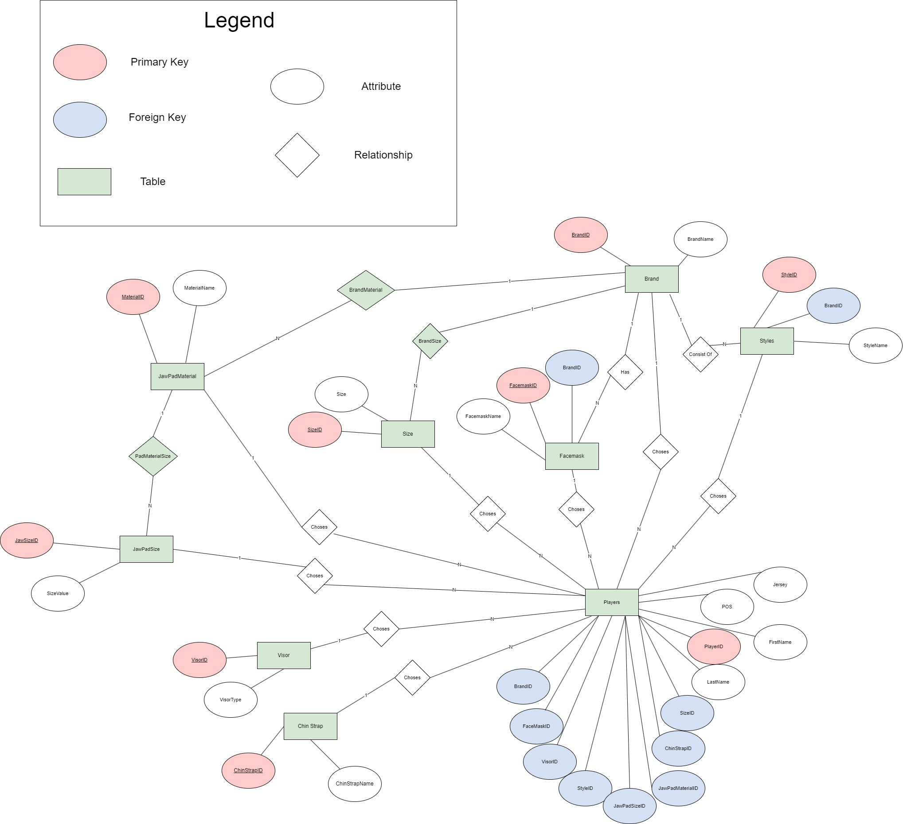

# EquipmentDatabase
The purpose of this repository is to design and create a database to hold information of specific helmet equipment choices for football players

## Tools
* Microsoft SQL Server used to store data
* Google diagrams used to create ERD diagram
* Python, Tkinter used to create a GUI inorder to streamline the data entry process

## Files
* EquipmentDBCreation.sql --> script to create the equipment database
* EquipmentProject.xlsx --> file that contains the information to be loaded into the database
* Equipment_ERD.png --> picture of my ERD diagram
* GUI.png --> picture of the GUI
* GUI.py --> python script for GUI
* Scripts_for_GUI.sql --> database script for GUI

## Methodology
### Database Design
The Equipment Database was designed as a relational database. It includes 12 tables which are described in more depth in *data dictionaries section*. 

### ERD Diagram

### Data Dictionaries 

**Table Name: Brand**
|Field Name | Data Type | Constraint | Description | Example|
|-----------|-----------|------------|-------------|--------|
| BrandID | INT | Primary Key | Unique identifier for each brand | 1 |
| BrandName | | VARCHAR | | Name of the brand | Schutt | 

**Table Name: Styles**
|Field Name | Data Type | Constraint | Description | Example|
|-----------|-----------|------------|-------------|--------|
| StyleID | INT | Primary Kay | Unique identifier for each style | 2 |
| StyleName| VARCHAR | | Name of the style| Zero2-R |

**Table Name: Size**
|Field Name | Data Type | Constraint | Description | Example|
|-----------|-----------|------------|-------------|--------|
| SizeID | INT | Primary Key | Unique identifier for each size | 3 |
| Size | VARCHAR | | Size of equipment | M |

**Table Name: Facemask**
|Field Name | Data Type | Constraint | Description | Example|
|-----------|-----------|------------|-------------|--------|
| FacemaskID | INT | Primary Key | Unique identifier for each facemask | 4 |
| FacemaskName | VARCHAR | | Name of the facemask | Axiom 2BC-TI |
| BrandID | INT | Foreign Key | Reference to key in Brand table | 1 |

**Table Name: JawPadMaterial**
|Field Name | Data Type | Constraint | Description | Example|
|-----------|-----------|------------|-------------|--------|

**Table Name: JawPadSize**

|Field Name | Data Type | Constraint | Description | Example|
|-----------|-----------|------------|-------------|--------|

**Table Name: Visor**

|Field Name | Data Type | Constraint | Description | Example|
|-----------|-----------|------------|-------------|--------|

**Table Name: ChinStrap**

|Field Name | Data Type | Constraint | Description | Example|
|-----------|-----------|------------|-------------|--------|

**Table Name: Players**

|Field Name | Data Type | Constraint | Description | Example|
|-----------|-----------|------------|-------------|--------|

**Table Name: BrandMaterial**

|Field Name | Data Type | Constraint | Description | Example|
|-----------|-----------|------------|-------------|--------|

**Table Name: BrandSize**

|Field Name | Data Type | Constraint | Description | Example|
|-----------|-----------|------------|-------------|--------|

**Table Name: PadMaterialSize**

|Field Name | Data Type | Constraint | Description | Example|
|-----------|-----------|------------|-------------|--------|

